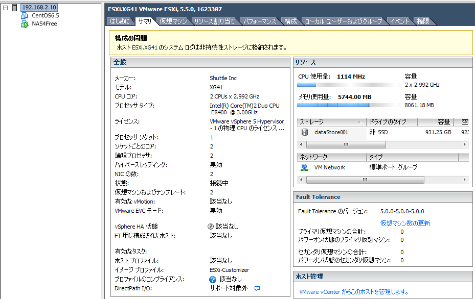

## 2014/10/31
## USBメモリにESXi5.5 のインストーラを作成する方法

### 用意するもの
4GBと8GBのUSBメモリを2つ用意して、CentOS6.5 を使って作成します。  
再帰的に同じメモリにインストール出来ればそれでいいんですが、なんか出来なくなっていた様ですので。

### TO
Shuttle社のベアボーンキットである、XG41をホストマシンとして  
USB(4GB) からブートするESXiサーバーを作成します。

### DO

#### NIC のドライバを手に入れる
蟹チップだったので以下のエラーが  
※ SS消失  
` Realtek 8168 NIC in ESXi 5.5 not detected by default `  

そこで、ESXi-Customizer を使ってドライバ組込みのISOファイルを作成する。  

* ESXi-Customizer
    * [VMware Front Experience](http://www.v-front.de/p/esxi-customizer.html)
* ドライバ 【VMware_bootbank_net-r8168_8.013.00-3vmw.510.0.0.799733】  (下記のうちどれかからGET)
    * [ESX virtualization](http://www.vladan.fr/realtek-8169-nics-not-detected-under-esxi-5-5/)
    * [TinkerTry IT @ home](http://www.tinkertry.com/install-esxi-5-5-with-realtek-8111-or-8168-nic/)
    * [Mike Tabor](http://miketabor.com/add-realtek-r8168-to-esxi-5-5/)


で、` ESXi-Customizer.cmd ` を実行して、オリジナルのESXiイメージとドライバを選択して。  
出力先の名前を決めて完了。


#### USBメモリのフォーマットとBootフラグの設定
CD-R ドライブが付いていないので、BootableなUSBメモリを作る。  
以降の作業は作業用Linuxホストにて行います。  
なんかsyslinux が必要なので。

#### USBメモリ内にパーティションを作成

`fdisk -l`

> ディスク /dev/sda: 21.5 GB, 21474836480 バイト        **← これはOSの入ったHDD**  
> ヘッド 255, セクタ 63, シリンダ 2610  
> Units = シリンダ数 of 16065 * 512 = 8225280 バイト  
> セクタサイズ (論理 / 物理): 512 バイト / 512 バイト  
> I/O size (minimum/optimal): 512 bytes / 512 bytes  
> ディスク識別子: 0x000bf29c  
>   
> -------- 省略 --------  
>   
> ディスク /dev/sdb: 4026 MB, 4026531840 バイト         **← これがUSBメモリ**  
> ヘッド 124, セクタ 62, シリンダ 1022  
> Units = シリンダ数 of 7688 * 512 = 3936256 バイト  
> セクタサイズ (論理 / 物理): 512 バイト / 512 バイト  
> I/O size (minimum/optimal): 512 bytes / 512 bytes  
> ディスク識別子: 0x6f20736b  

/dev/sdb がUSBメモリだとする。

0. `fdisk /dev/sdb/`
  * d ← パーティションを削除
  * n ← パーティションを作成
      * p ← Primary を選択
      * 1 ← パーティションNoを指定。1番。
      * Enter ← シリンダ指定。デフォルトの1。
      * Enter ← 最終シリンダ指定。デフォルト。
  * t ← パーティションのタイプ指定
      * c ← FAT32 を示す` c ` を指定
  * a ← Bootable 指定
      * 1 ← 1番パーティションを指定
  * p ← パーティション設定を確認

> ディスク /dev/sdb: 4026 MB, 4026531840 バイト  
> ヘッド 124, セクタ 62, シリンダ 1022  
> Units = シリンダ数 of 7688 * 512 = 3936256 バイト  
> セクタサイズ (論理 / 物理): 512 バイト / 512 バイト  
> I/O size (minimum/optimal): 512 bytes / 512 bytes  
> ディスク識別子: 0x6f20736b  
>   
> デバイス ブート      始点        終点     ブロック   Id  システム  
> /dev/sdb1   *           1        1022     3928537    c  W95 FAT32 (LBA)  

、、、OKですね(・∀・)  
では、wを押下して書き込みます。  
  * w ← 設定を書き込む。


#### FAT32 でフォーマット
```bash
mkfs.vfat -F 32 -n ESXi-Installer /dev/sdb1
```

明示的にフォーマットする必要があるみたいですね。  

### syslinux とか組込む

syslinux でブート用のシステムをUSBメモリに組み込む。  
そんで、ブート用のMBRを書き込む。

```bash
syslinux /dev/sdb1
dd if=/usr/share/syslinux/mbr.bin of=/dev/sdb bs=440 count=1
```

#### ESXiインストーラの中身をUSBメモリにコピー

イメージファイルをそのままマウントして、中身を全部コピーする。

```bash
mkdir /mnt/usb
mount /dev/sdb1 /mnt/usb
mount -o loop /home/USER/iso/ESXi-xxx.iso /media
cp -r /media -T /mnt/usb
```

#### syslinux.cfg の作成
コピーしたUSB内のisolinux.cfg からsyslinux.cfg をコピーし、中身をちょいと修正

```bash
cd /mnt/usb
cp isolinux.cfg syslinux.cfg
vi syslinux.cfg
```

> DEFAULT mboot.c32  ←  **ここをmenu32.c32 からmboot.c32 に書き換える**  
> MENU TITLE ESXi-5.5.0-20140302001-standard Boot Menu  
> NOHALT 1  
> PROMPT 0  
> TIMEOUT 80  
> LABEL install  
>   KERNEL mboot.c32  
>   APPEND -c boot.cfg  
>   MENU LABEL ESXi-5.5.0-20140302001-standard ^Installer  
> LABEL hddboot  
>   LOCALBOOT 0x80  
>   MENU LABEL ^Boot from local disk  
> LABEL comment0  
>   MENU LABEL  
> LABEL comment1  
>   MENU LABEL +------------------------------------------------------+  
> LABEL comment2  
>   MENU LABEL |         Customized by ESXi-Customizer 2.7.2          |  
> LABEL comment3  
>   MENU LABEL |          http://esxi-customizer.v-front.de           |  
> LABEL comment4  
>   MENU LABEL +------------------------------------------------------+  

### 後始末
USB メモリとイメージをumountしておく。

```bash
umount /mnt/usb
umount /media
```

## ESXi のインストール

完成した4GBのUSBメモリをXG41にぶっ刺し、そこからブートする。  
後はインストーラに従って、8GBのUSBメモリを指定してESXiをインストールすればOK!  
  

これで、CentOS6.5 と、NAS4free を一台のホストマシンで同時起動出来るようになりました！  
素敵ですやん(・∀・)  


以上です。

---
