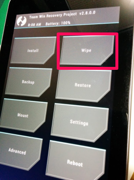

## Nexus7(2012) にLolipop ば入れる！

### Nexus6 はまだか

えー、我慢出来なくなって、ムシャクシャしてやりました。  
環境はNexus7 (2012) WiFiモデルです。

### ブートローダアンロックの準備と実行

Nexus7 のファクトリーイメージを取得しておくと、安心です。  
[Factory Images "nakasi" for Nexus7(Wi-Fi)](https://developers.google.com/android/nexus/images)  
今回もChocolatey を使って環境を作ります。ホストはWindows7 pro 64bit です。

#### Java.JDK 7.0.60.1 と、android SDK 23.0.2 をインストール

```haskell
cinst java.jdk
cinst android-sdk
```

0. インストールが完了したら、Winメニューから "Android SDK Manager" -> "SDK Manager" と進み、"Android 4.4W.2(API 20)" を選択してそのまま右下の 'Install 17 packages' をクリック(数は適当)

0. Accept License で同意。(ちょいと時間かかります)

0. システム変数PATHに、以下を追加

> C:\Users\foo\AppData\Local\Android\android-sdk\platform-tools  
> C:\Users\foo\AppData\Local\Android\android-sdk\tools  

ここでも、Rapid Environment Editor が役に立ちますね。

```haskell
cinst Devbox-RapidEE
```


Android SDK をインストールしている間に、Nexus7(2012)のUSBデバッグを、開発者オプションから有効にしておきましょう。  
もしNexus7 のUSBドライバが自動で入らなかったら以下からDLして、デバイスマネージャから指定してインストールしておく。[Google USB Driver](http://developer.android.com/sdk/win-usb.html#download)  
で、完了したらUSBでホストに接続して、デバッグを許可する。  
そして以下のうちどちらかでブートローダを表示させる。

* 電源 + volDown 同時押しで起動
* コマンドプロンプトから `adb reboot bootloader`

#### ブートローダ アン・ローック！！

**以下のコマンドをプロンプトで打ち込むと、ユーザーデータが消去されます！**  
**よく準備してから叩き込んで下さい！**

```
fastboot oem unlock
```

> (bootloader) erasing userdata...
> (bootloader) erasing userdata done
> (bootloader) erasing cache...
> (bootloader) erasing cache done
> (bootloader) unlocking...
> (bootloader) Bootloader is unlocked now.
> OKAY [189.221s]
> finished. total time: 189.224s

### さーアンロック状態だー

再起動すると、android version は4.4.4のままでした。  
当たり前か：P

#### TWRP (Team Win Recovery Project) の実機への焼きこみ(ROM焼き)

Android 標準のリカバリーモードでも、まあ、いいっちゃいいらしいんですが  
どうせならこっち使ったほうがバックアップとかも出来る高性能リカバリなんだぜ？  

と、いう訳で TWRP というカスタムリカバリROM を焼いていきます。
ホストマシンとNexus7 は、まだUSBで繋がったままです。

**バックアップをするつもりが無ければ、Abdroid5.0 Lolipop書き込み！まで手順を飛ばしても大丈夫です。**

さて、手順は以下。

0. [TeamWin](http://teamw.in/twrp_view_all_devices) からカスタムリカバリのDL
  * openrecovery-twrp-2.8.0.0-grouper.img
  * **openrecovery-twrp-2.8.1.0-grouper.img では起動できませんでした**

0. ブートローダのアンロック
  * 電源 + volDown 同時押しで起動
  * コマンドプロンプトから `adb reboot bootloader`

0. openrecovery-twrp-2.8.0.0-grouper.img のあるディレクトリで以下のコマンドをぶっ叩く(あ、慎重に)  

```
fastboot boot openrecovery-twrp-2.8.0.0-grouper.img
```

> creating boot image...
> creating boot image - 8192 bytes
> downloading 'boot.img'...
> OKAY [  0.013s]
> booting...
> OKAY [  0.018s]
> finished. total time: 0.033s

こんな表示が出ると、OKです。  

0. `adb reboot bootloader` でもう一度再起動する。

そして、ここがわかりにくい所だったんですが  
ブートローダ画面でいつまで待っていても、TWRPは起動してくれません！  
ボリュームボタンを何回か押すと、図の位置に **Recovery Mode** と表示されます。  
そこで電源ボタン(決定) を押して初めて、TWRP が起動してきます！  


文鎮化しない為にも、現状のファクトリーリセットされた状態をバックアップしておきましょう。

このデータはメニューの`Wipe` で完全に消さない限り残ります。  


### Android5.0 Lolipop 書き込み！

* と、ここで Nexus7(2012) Wi-Fi版のファクトリーイメージがリークされたっつーリンクを発見（
* [ここから](https://developers.google.com/android/nexus/images) tgzを拾ってきて`tar zxvf nakasi-lrx21p-factory-93daa4d3.tgz` で展開する。  
> `Factory Images "nakasi" for Nexus 7 (Wi-Fi)` ですね。

中にある`flash-all.bat` を起動すると、Lolipop が立ち上がります！  
中身はこんな感じ。怪しい所も無さそうですね。

```bat
@ECHO OFF
:: Copyright 2012 The Android Open Source Project
::
:: Licensed under the Apache License, Version 2.0 (the "License");
:: you may not use this file except in compliance with the License.
:: You may obtain a copy of the License at
::
::      http://www.apache.org/licenses/LICENSE-2.0
::
:: Unless required by applicable law or agreed to in writing, software
:: distributed under the License is distributed on an "AS IS" BASIS,
:: WITHOUT WARRANTIES OR CONDITIONS OF ANY KIND, either express or implied.
:: See the License for the specific language governing permissions and
:: limitations under the License.

PATH=%PATH%;"%SYSTEMROOT%\System32"
fastboot oem unlock
fastboot erase boot
fastboot erase cache
fastboot erase recovery
fastboot erase system
fastboot erase userdata
fastboot flash bootloader bootloader-grouper-4.23.img
fastboot reboot-bootloader
ping -n 10 127.0.0.1 >nul
fastboot -w update image-nakasi-lrx21p.zip

echo Press any key to exit...
pause >nul
exit
```

### 出来上がり
んで、キターー！(・∀・)  


#### 簡単に触ってみての所感
* wifi接続にwps使えへんのかい、、、
* タップアンドゴー？NFCを使ってアカウントデータを転送する機能らしい。
Nexus5と合わせてみましたが、ここはすんなり行きました。
* お、2つ目のアカウントも同期してくれましたね
* 同期するアプリも選べました
* 後でもう少しまとめます。
13日に発表されるかもしれないので、取り急ぎ記事にしてみました、ﾏﾙ。
