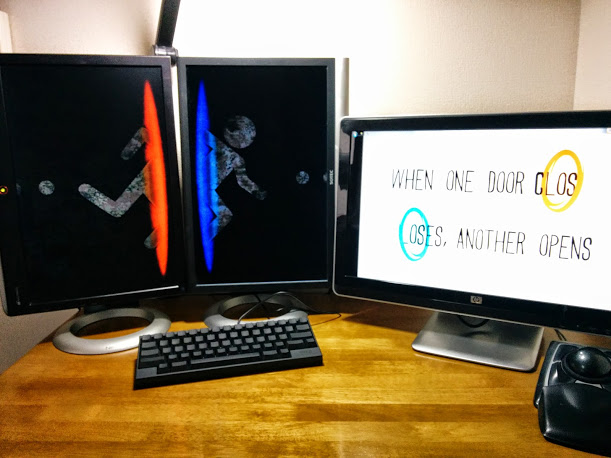

## めっちゃ欲しいサイズのモニタが出た。

おー、やっと欲しいサイズが出た。  
縦横Full HDサイズ！

<a style="color:#0070C5;" href="http://www.eizo.co.jp/products/lcd/ev2730q/index.html" target="_blank">FlexScan EV2730Q | EIZO株式会社</a> <strong>ITワーカーの"ちょっと足りない"を完全解消する縦ワイド×横ワイド（1920×1920ドット）モニター</strong>  

### 縦ディスプレイいいよ、素敵ですよ

と言いつつも、布教しつつも  
結局は幅が足りなくて起動出来ないゲームやアプリがあるから仕方なく横型ディスプレイも併用しているわけだけど  
場所も取るし電気代も設備費も掛かるし窓の出現位置とか微妙に一定しない。  

でも、これならば全部解決。  
自炊漫画とかの見開き表示も完璧。だろう。

そもそもがブログとかショッピングサイトは縦型ディスプレイの方が絶対に読みやすいし  
情報を一気に俯瞰出来るフォーマットなんだから  
メーカーはいつまで横幅にこだわり続けているんだろうと素朴に思う。ました。  

誰も彼もが映画やテレビ観る用途じゃねーのになーと。

これが先駆けとなって、各メーカーが競う様になってくれたら嬉しいですねー。  

少なくとも、質のこだわりか価格のこだわりかを選べるぐらいのラインナップが現れると更にとんでもなく嬉しいですねー。

なんだ、買わないのか？ですって？

あれです。

いくらEIZOでも、人柱は御免なのですよーだ(・﹃・)

